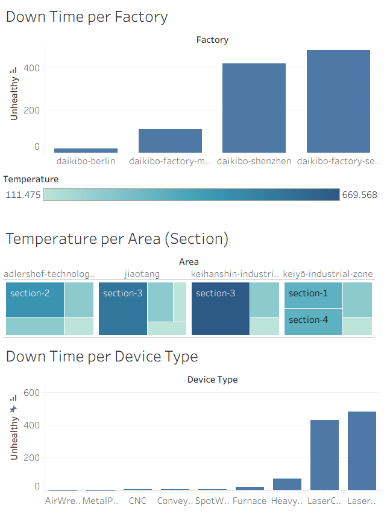

# Daikibo Industrials Operational Telemetry Dashboard Analysis Report

## Executive Summary
This report focuses on the visual analysis of the operational telemetry dashboard across Daikibo's four main manufacturing facilities. Based on the extracted data, there is a very strong and direct correlation between extreme ambient factory temperatures and the downtime rate of high-precision laser technology machines. The following is a breakdown of the quantitative findings and strategic recommendations for management decision-making.

---

## Performance Findings by Factory Location
Analysis of the "Down Time per Factory" chart shows a drastic performance disparity between the production facilities:

| Factory Location | Performance Status | Unhealthy Units | Operational Notes |
| :--- | :--- | :--- | :--- |
| **Daikibo Factory Seiko** | Major Crisis | 480 | The largest contributor to downtime, requiring the most urgent operational intervention. |
| **Daikibo Shenzhen** | Critical Warning | 420 | Ranks as the second worst facility. |
| **Daikibo Factory Meiyo** | Moderate Level | 110 | Sits at a moderate performance boundary. |
| **Daikibo Berlin** | Optimal Benchmark | 20 | The best-performing facility; practices should serve as the global operational standard. |

---

## Performance Findings by Device Type
The "Down Time per Device Type" chart clearly isolates which machine types are the operational weak points.

* **Highly Vulnerable Laser Technology Machines:** Almost 100% of the total production paralysis is caused by optical-based machines.
* **Highest Breakdowns:** The Laser Welder recorded 480 breakdown units.
* **Second Highest Breakdowns:** The Laser Cutter closely followed with 430 breakdown units.
* **Conventional Machines Proven Resilient:** Heavy industrial machines such as the Air Wrench, CNC, Conveyor Belt, Metal Press, and Spot Welder recorded perfect track records with 0 breakdown units.
* **Heat-Resistant Machines:** The Heavy Duty Drill (70 units) and Furnace (20 units) contributed very little to the overall downtime.

---

## Ambient Temperature Correlation Analysis
The "Temperature per Area (Section)" treemap visualization and its accompanying color scale provide the root-cause answer as to why laser machines break down so frequently in specific factories.

* **Extreme Temperature as a Causality Factor:** The temperature scale shows a range from a low of 111.475 up to an extreme high of 669.568 (represented by the dark navy blue).
* **Most Critical Temperature Locations:** The keihanshin-industrial-zone (Osaka) and the jiaotang area (Shenzhen) explicitly show "section-3" highlighted in the darkest blue.
* **Conclusion:** This conclusively indicates that these specific factory sections are exposed to maximum, extreme temperatures.
* **Ideal Conditions in Berlin:** The adlershof-technology area is dominated by light blue and bright green across its sections, indicating low and stable ambient temperatures.

---

## Strategic Insights & Decision-Making Recommendations
Based on the data synthesis above, executive management must immediately act upon the following targeted strategies.

### 1. Interventions on "Section-3" in Seiko and Shenzhen
The massive breakdowns of Laser Welders and Laser Cutters are not due to inherent machine defects. These highly sensitive machines are placed in "section-3", which is suffering from extreme thermal radiation (>600). 
* **Decision:** Immediately audit and overhaul the air conditioning systems (HVAC) or the specific liquid machine chillers in "section-3" at the Seiko and Shenzhen facilities.

### 2. Relocate Sensitive Assets
Conventional machines (like the Metal Press or Furnace) are proven to be immune to high temperatures.
* **Decision:** Relocate the Laser Welder and Laser Cutter machines out of "section-3" and into a designated clean, temperature-controlled room.
* **Alternative:** If relocation is not physically possible, swap their floor positions with the Furnace machines, which are intrinsically designed to withstand extreme ambient heat.

### 3. Establish Berlin as the Thermal Standard Operating Procedure (SOP)
Daikibo Berlin has successfully managed its thermodynamic environment, resulting in minimal machine breakdowns.
* **Decision:** Dispatch an engineering team from Seiko and Shenzhen to study and replicate the air circulation architecture, thermal insulation, and machine layout of the Berlin factory.

### 4. Maintenance Budget Allocation (CAPEX/OPEX)
* **Decision:** Halt excessive preventative maintenance spending on conventional machines (Air Wrench, CNC, Conveyor Belts, etc.) as the data proves they are highly resilient and not currently failing.
* **Action:** Redirect 100% of that budget and maintenance technician labor toward servicing, cleaning, and cooling the Laser Welder and Laser Cutter instruments.

---

## About This Project & Works Cited
This repository contains solutions to Deloitte Australia's Data Analytics Job Simulation on Forage. It features Tableau dashboards for machine downtime analysis and Excel-based gender pay equality classification with step-by-step documentation.

* **Source
